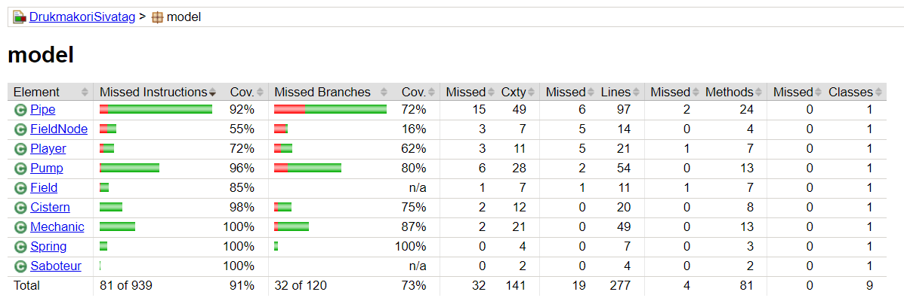

# Egységtesztek készítése

A feladat során **jUnit** egységteszteket készítettünk a kiinduló projekthez. A tesztekben a *model* könyvtár osztályait teszteltük, rendre létrehozva egy-egy teszt osztályt a különböző model osztályokhoz:

 - *PlayerTest:* Ezen osztály tartalmazza a Player osztályhoz tartozó teszteseteket. Itt tesztelésre került a Playerhez tartozó számos metódus, többek között az elemek közötti mozgás, valamint interakció a pályaelemekkel (csövek törése, csúszóssá tétele).

 - *MechanicTest:* Az osztály tartalmazza a Szerelőre specikikus metódusok tesztelését. Ide sorolható a csövek, valamint pumpák felvétele a megfelelő helyekről, ezek lehelyezése, javítása, valamint konfigurálása.

 - *SaboteurTest:* A Szabotőrök kevés specifikus cselekvéssel rendelkeznek, ezért itt csupán a csövek csúszóssá tételét teszteljük.

 - *PipeTest:* A csövek esetén leteszteltük azok működését különböző szcenáriókban: hogyan működnek, ha mindkét végüg csatlakoztatva van, vagy ha csupán az egyik, mi történik abban az esetben, ha törött állapotban folyik bele víz. Figyeltünk a szélsőséges esetek tesztelésére is, mint például a nagyobb víztömeg beállítása, mint az aktuális kapacitás, vagy kettőnél több elemre való felcsatlakoztatása a csőnek.

 - *PumpTest:* Az osztály tartalmazza a pumpákra vonatkozó egységteszteket, amelyek tartalmazzák a pumpák elvárt működésének tesztelését számos esetet figyelembe véve. Ide tartoznak a különböző cső-csatlakoztatási műveletek, a pumpa beállításának akciója, valamint a helyes víztovábbítási működés.

  - *SpringTest:* A források esetén az egységtesztek segítségével biztosítottuk azok helyes víztovábbítási műveletét.

   - *CisternTest:* A ciszternák esetében teszteltük, hogy a víz befogadása, eltárolása és a befolyt mennyiség kiszámolása valóban helyesen működik-e.

# Lefedettségi metrikák (JaCoCo)

A lefedettségi metrikák számolásához a *JaCoCo* nevű eszközt használtuk. Az eszközt integráltuk a GitHub Actions-be, így a workflow segítségével a tesztek lefuttatását követően automatikusan legenerálódik a JaCoCo report, valamint feltöltésre kerül az **Artifacts**-ok közé.

Az eszköz beüzemelését követően, a kapott adatok alapján kibővítésre került a tesztkészlet, így javítva annak minőségén, lefedettségén.

Az alábbi képen látható az elért lefedettségi eredmény:

Utasítás lefedettség: **91%** ,
Döntési lefedettség: **73%**